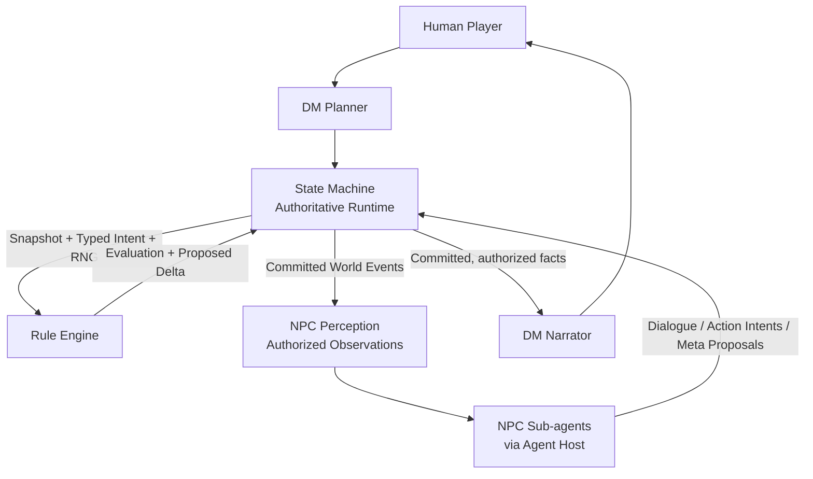

# Agentic TRPG

**A modular architecture for AI-driven tabletop role-playing games, combining autonomous characters with deterministic game rules.**

> **Project status:** Architecture and interface design in progress. This repository is the project-wide documentation and coordination hub, **not** a standalone playable application. The specifications describe the intended system; they do not imply that all interfaces or components are implemented.

## Overview

Agentic TRPG aims to create a tabletop role-playing experience where an AI Game Master can run an adventure, non-player characters can make their own decisions, and a deterministic rules engine handles game mechanics.

The central design principle is simple:

**Let LLMs handle language, narrative judgment, and character decisions; let deterministic software validate rules and commit game state.**

The project separates the AI Game Master, the authoritative game runtime, the rules engine, and the future visual presentation layer. The architecture is intended to be extensible beyond a single ruleset, although the first MVP focuses on a D&D adventure.

## System architecture



### Main responsibilities

| Component | Responsibility |
| --- | --- |
| **Agent DM** | Interpret player input, coordinate the adventure and NPCs, make authorized narrative/GM judgments, and narrate committed outcomes. The DM Planner and DM Narrator have separate contexts and permissions. |
| **NPC Sub-agents** | Maintain character-specific perspectives and propose dialogue, actions, beliefs, memories, and goals. They do not directly mutate game state. |
| **Agent Host** | Execute LLM calls and manage prompts, contexts, invocation retries, and inference resources; it does not own authoritative game state. |
| **State Machine** | Own and atomically commit session, world, character, combat, RNG, and persistent NPC state. Enforce permissions, versions, idempotency, and observation delivery. |
| **Rule Engine** | Evaluate supported mechanical rules against explicit inputs and return typed, *uncommitted* outcomes. It does not own persistent authoritative combat state in the target architecture. |
| **Visual Presentation** | Future presentation of maps, tokens, scenes, and animations. It is outside the first MVP. |

The ownership model is established by [ADR-001: Unified Authoritative Runtime State Ownership](docs/ADR-001-UNIFIED-STATE-OWNERSHIP.md).

### Events, perception, and NPC knowledge

A committed world event is not automatically known to every character. The intended pipeline is:

```text
Committed World Event + Observable Signals
    → Scope-based NPC Discovery
    → Deterministic / optional JEV Perception Judgment
    → Authorized Observation
    → Existing NPC Inbox and Evaluation Flow
```

NPCs receive only observations they could perceive and are authorized to know. Their beliefs and memories are separate from objective world facts. Event observations do not automatically trigger an LLM call or change a character's goals.

## First MVP

The initial milestone is a **locally runnable, text-first, single-player adventure**:

- One human player controls one player character, with no permanent AI party companions.
- The AI Game Master supports dialogue, exploration, checks, combat, and adventure progression.
- NPC Sub-agents can independently propose meaningful dialogue and actions, including at least one enemy combat-intent path.
- Rules-based outcomes are evaluated by the Rule Engine and committed by the State Machine.
- The adventure is loaded from a manually prepared and reviewed Adventure Package.
- A complete, repeatable end-to-end experience takes priority over broad ruleset coverage or visual polish.

The selected private integration scenario is *First Blush* (D&D Duet), subject to content rights and manual rules adaptation. **The original adventure text, maps, and unauthorized derivative content are not distributed in this repository.** D&D SRD 5.2.1 is the proposed initial mechanical baseline; final compatibility is governed by the relevant specifications and implementation tests.

**Not part of the first MVP:** multiplayer, permanent AI companions, automatic adventure-document ingestion / World Creation Agent, interactive tactical visualization, or guaranteed exact restoration of an interrupted active combat.

See [MVP Scope](docs/MVP_SCOPE.md) for precise requirements and open decisions.

## Repositories

| Repository | Role |
| --- | --- |
| **[agentic-trpg/agentic-trpg](https://github.com/agentic-trpg/agentic-trpg)** | This repository: overall project direction, architecture decisions, cross-module interface contracts, MVP definition, and shared documentation. |
| **[agentic-trpg/trpg-rules-engine](https://github.com/agentic-trpg/trpg-rules-engine)** | Rules engine implementation, tests, and mechanics-specific development. Its existing code and the target stateless evaluation boundary are not assumed to be identical. |

Other components are described in the architecture but are not represented here as already-published repositories.

## Documentation

The design documents are currently written primarily in Chinese. Start with the MVP scope and the accepted architecture decision before reading the detailed contracts.

| Document | Purpose |
| --- | --- |
| [MVP Scope](docs/MVP_SCOPE.md) | Product goals, first playable milestone, acceptance boundaries, and deferred features. |
| [ADR-001 — Unified State Ownership](docs/ADR-001-UNIFIED-STATE-OWNERSHIP.md) | Accepted decision defining the State Machine as the sole authoritative runtime state owner. |
| [State Machine Architecture](docs/STATE_MACHINE_ARCHITECTURE.md) | Session lifecycle, persistence, world events, NPC perception, authorization, and atomic commits. |
| [Agent Architecture](docs/AGENT_ARCHITECTURE.md) | DM Planner/Narrator separation, NPC Sub-agents, Host responsibilities, and evaluation modes. |
| [Module Contracts](docs/MODULE_CONTRACTS.md) | Proposed cross-module requests, results, typed commands, receipts, observations, and failure semantics. |
| [Adventure Package Schema](docs/ADVENTURE_PACKAGE_SCHEMA.md) | Static adventure content, validation, initialization, and runtime separation. |

### Design status and terminology

The architecture documents distinguish the status of individual decisions:

- **`[DECIDED]`** — Agreed design direction or invariant.
- **`[PROPOSED]`** — Candidate interface or policy, subject to review.
- **`[OPEN]`** — Unresolved design or implementation decision.
- **`[NOT IMPLEMENTED]`** — Documented target behavior, not a claim of working code.

An accepted ADR establishes architectural intent; it does **not** certify that every module already conforms to it. For the actual implementation status, refer to the code and tests in the relevant repository.

## Development direction

The current emphasis is to turn the documented contracts into a working vertical slice:

1. Compare documented interfaces with existing implementations and identify concrete integration gaps.
2. Integrate typed commands, rules evaluation, version checks, and atomic state commits.
3. Connect committed events to authorized NPC observations, evaluations, and reliable output delivery.
4. Run an end-to-end text-based adventure and validate persistence, error handling, and recovery.

The priority is a correct, testable execution loop—not additional agents, services, or abstraction layers without a demonstrated need.

## Contributing

Architecture and implementation discussions are welcome. When proposing a change, identify the affected module boundary, distinguish agreed behavior from proposed behavior, and avoid describing draft APIs as already implemented. Please refer to the relevant design document and the owning code repository before submitting a change.

## Licensing and content

This meta-repository currently has no repository-level `LICENSE` file; do not assume a license for its contents. Separate repositories may have their own licenses. Adventure and ruleset source material may also have independent copyright and licensing restrictions; do not commit protected third-party adventure content without the necessary rights.
